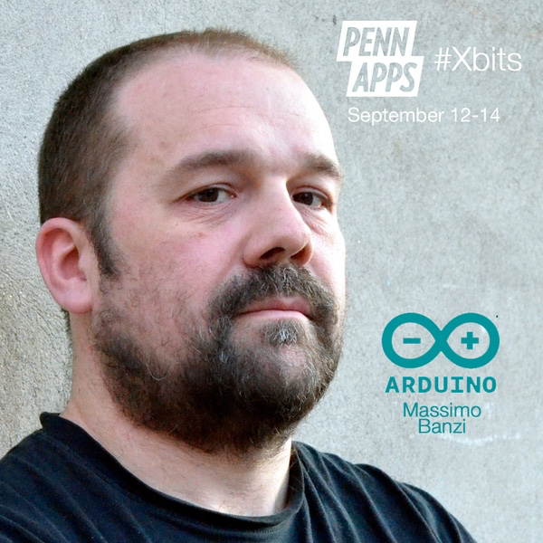
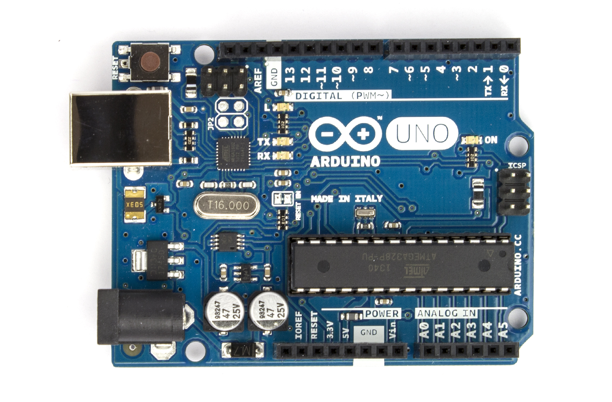
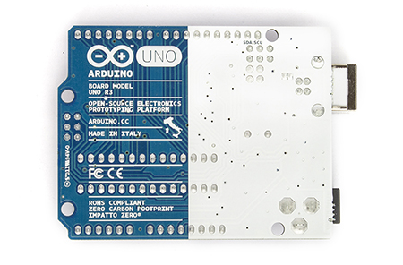
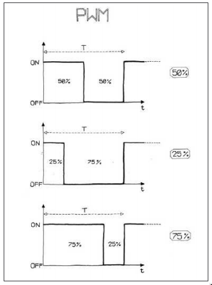
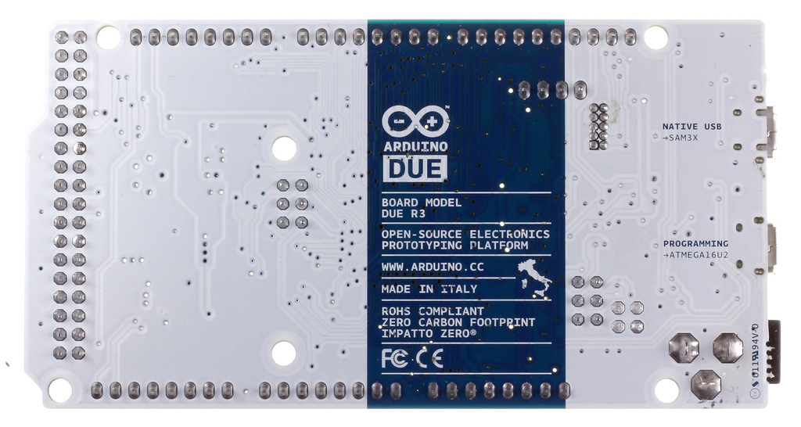
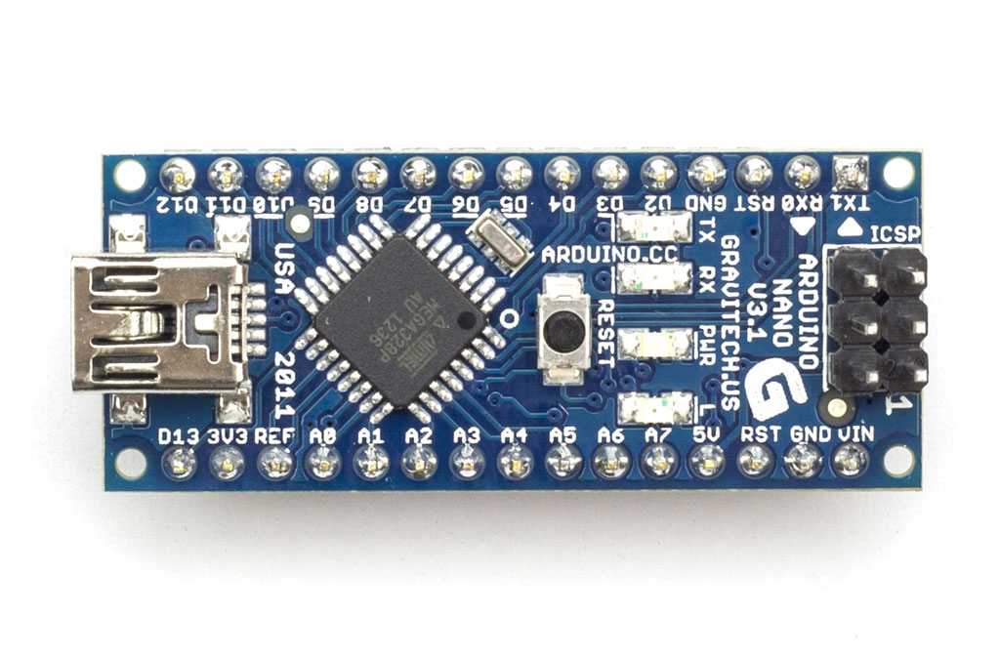
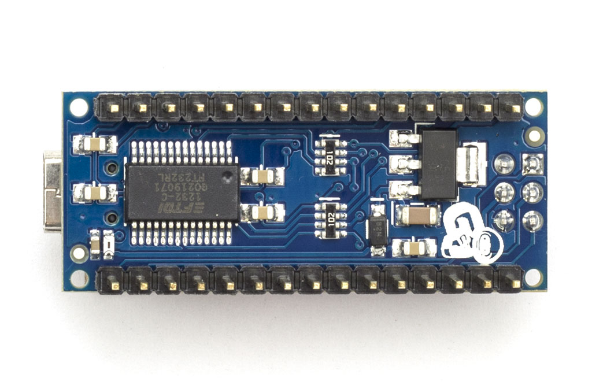

## Massimo Banzi

## Idee des Arduino Boards

- Arduino-Erfinder Massimo Banzi: Ein Board, auf dem entwickelt wird, das aber auch im Projekt eingesetzt werden kann.
- Wenig Lernaufwand für Hardware und Software, auch für IT-ferne Menschen.
- Auch für Profis mit diversen Tools programmierbar
- Eigenes Ökosystem mit Shields und charakteristischen Pin-Reihen.

Die IDE von Arduino ist ein Klon Processing-IDE. Sie ist eine stark vereinfachte Entwicklungsumgebung zur Programmierung von Arduino Boards.
Der Arduinoprozessor, ein Atmel 328P Chip wird über die IDE in `C++` programmiert, bzw. einer vereinfachten Variante davon. Die IDE übernimmt dabei auch das Kompilieren des Hochsprachencodes in Maschinencode wie auch das Hochladen auf den Prozessor. Als Schnittstelle dient die serielle Schnittstelle des PC's über USB.

#

#

#

#

#

#

# Technische Daten des Uno-Boards
- Prozessor
- Stromversorgung
- Speicher

## Der Prozessor
- Mikrokontroller: ATmega328 P  
	SRAM: 2 KB, EEPROM: 1 KB (ATmega328)  
	Prozessortaklung: 16 MHz

## Speicher
- Flash Memory: 32 KB (ATmega328)  
	davon 0.5 KB für den Bootloader
- Maße und Gewicht: 68.6 mm x 53.4 mm, 25 g

## Stromversorgung
- Betriebsstrom: 5V  
	Eingabesstrom (empfohlen): 7-12V  
	Eingabestrom (Grenzen): 6-20V
- Digitale I/O Pins: 14 (6 mit PWM Ausgabe)  
	Analoge Input Pins: 6  
	DC Spannung pro I/O Pin: 40 mA  
	DC Spannung für den 3.3V Pin: 50 mA

# Der Aufbau des Boards

## USB-Port und USB-Chip
- Der USB-Port verbindet das Board mit dem Computer.
- Ist Daten- und Stromquelle.
- Hochladen neuer Programme.
- Konstanter Datenaustausch zwischen Computer und Board ist möglich.
- Kommunikation über einen onboard-USB-Chip.

## Stromanschluss
- Externe Anschlussmöglichkeit für ein Netzteil.
- Das Board läuft bei 7 bis 12 Volt.
- 40 mA werden für den Betrieb des Boards benötigt.
- Mehr bei Anschluß von weiteren Verbrauchern, z.B. LEDs.

## Reset-Schalter
- Mit dem Reset-Schalter kann das laufende Programm zurückgesetzt werden. Es startet dann wieder von neuem.

## Betriebsleuchte und Übertragungsleuchten
- Die mit PWR (für Power) markierte LED leuchtet bei Betrieb.
- Bei Datenübertragung blinken die mit TX und RX markierten Leuchtdioden.
- TX steht für Transmitter,
- RX für Receiver.

## Bootloader/ICSP-Header
- Über USB-Kabel kommuniziert man mit dem Bootloader.
- Er ermöglicht es ein neues Programm hochzuladen.
- Über den ICSP-Header (In-Circuit Serial Programming) ist eine direkte Kommunikation mit dem Mikroprozessor möglich.

## Digitale Pins
- 16 Steckplätze, davon 14 digitale I/O-Pins (Input/Output) mit den Zahlen 0 bis 13.
- Für alle Sensoren und Aktoren, die mit digitale Signalen arbeiten. Uum Beispiel LEDs und Schalter
- 6 PWM Pins. PWM = Pulsweitenmodulierung.  
	Damit lassen sich z.B. LEDs dimmen
- Pins 0 und 1 sind auch für die serielle Kommunikation mit dem Arduino. Setzt man diese gleichzeitig als digitale Aus- oder Eingänge ein, kann es zu merkwürdigen Nebenwirkungen kommen.
- Über Pin 10 bis 13 kann mit dem SPI-Protokoll kommuniziert werden (Nict Bestandteil unseres Kurses.

## GND
- 3 Massepunkte, die als Minuspol für den Stromkreis dienen.

## Analoge Pins
- 6 analoge Input-Ports
- Analoge Signale werden hier in digitale 8-Bit-Signale umgewandelt. (Wertebereich 0-1024).
